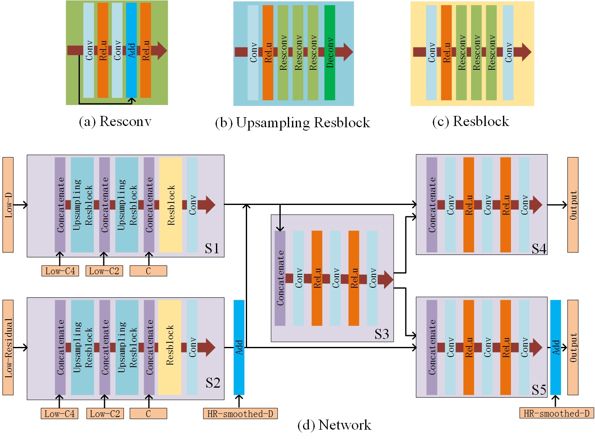
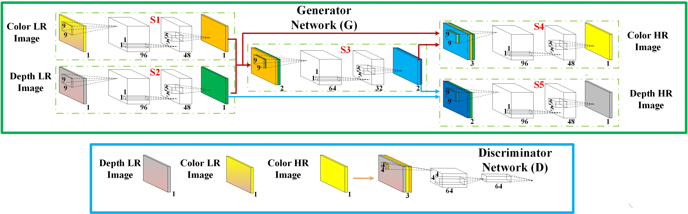
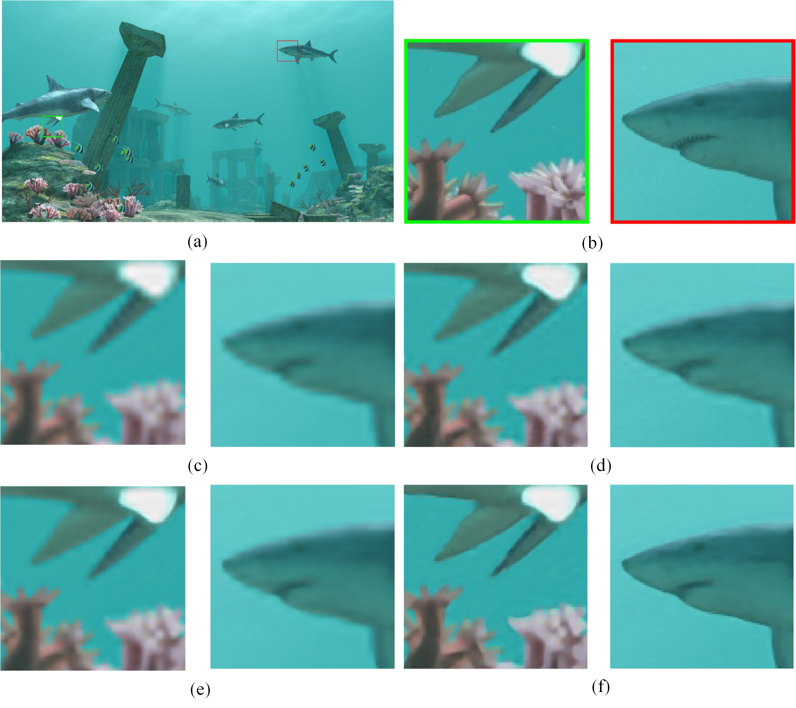
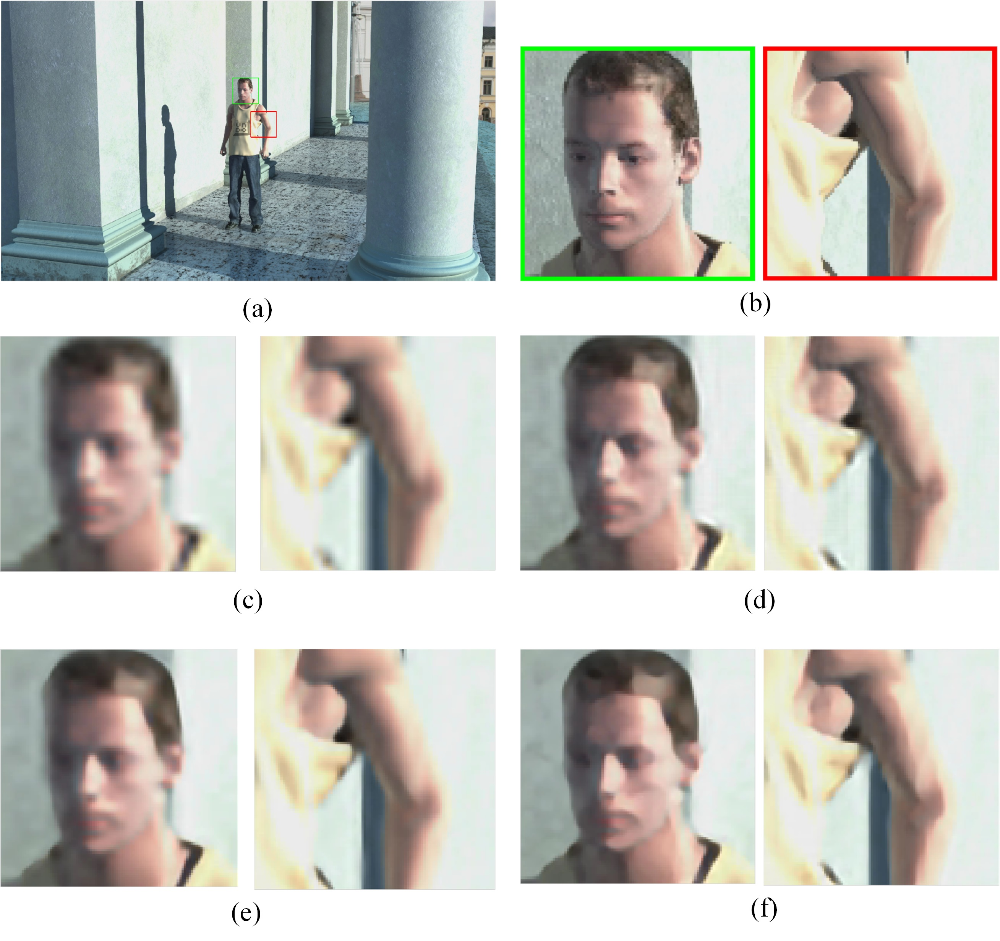
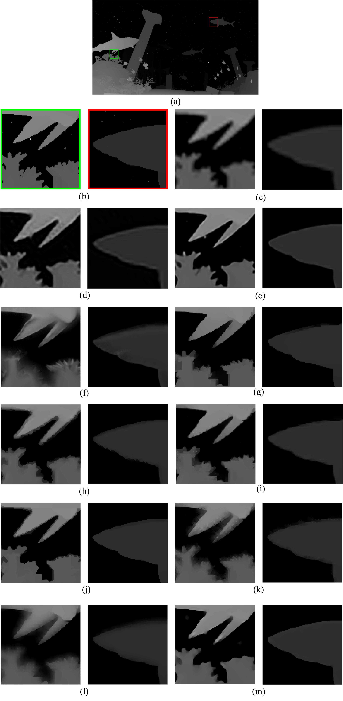
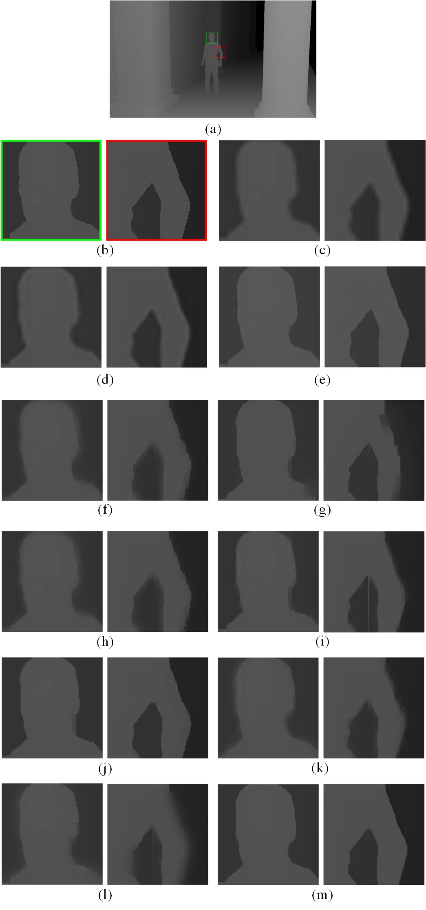

## Simultaneous color-depth super-resolution with conditional generative adversarial network---CDcGAN [[PDF]](https://www.sciencedirect.com/science/article/pii/S0031320318304175) (Pattern Recognition 2019), Lijun Zhao, Huihui Bai, Jie Liang, Bing Zen, Anhong Wang, Yao Zhao.

### HR-Color-Image Guided Depth Super-Resolution

  
  

### Simultaneous Color-Depth Super-Resolution

  
  

### Supplementary Results

  
  
  
The SR results for color image with 4x scaling factor. (a) the first frame of Shark, (b) the close-ups of (a), (c-f) the close-ups of the results respectively with Bicubic interpolation, SRCNN, VDSR, and our CDcGAN

  
  
  
The SR results for color image with 4x scaling factor. (a) the first frame of Undo_Dancer, (b) the close-ups of (a), (c-f) the close-ups of the results respectively with Bicubic interpolation, SRCNN, VDSR, and our CDcGAN

  
  
  
The SR results for depth image with 4x scaling factor. (a) the first frame of Shark, (b) the close-ups of (a), (c-m) the close-ups of the results respectively with Bicubic interpolation, SRCNN, VDSR, GIF, FGS, RGIF, TGV, RGDR, HQDU, MRF, and our CDcGAN

  
  
  
The SR results for depth image with 4x scaling factor. (a) the first frame of Undo_Dancer, (b) the close-ups of (a), (c-m) the close-ups of the results respectively with Bicubic interpolation, SRCNN , VDSR, GIF, FGS, RGIF, TGV, RGDR, HQDU, MRF, and our CDcGAN

